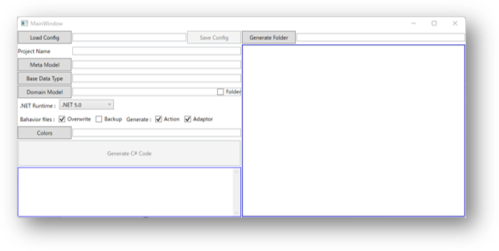
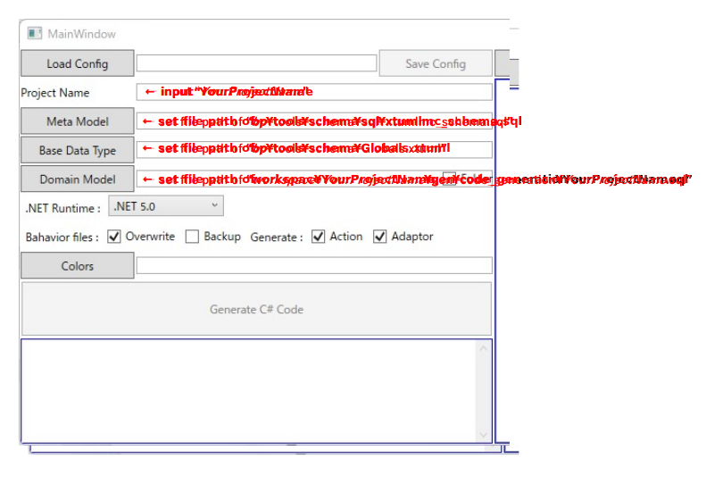
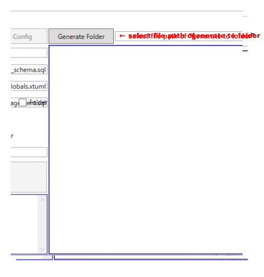

# Wpf Application Csharp Code Generator
Please open [Kae.XTUML.Tools.WpfAppChsarpGenerator.csproj](./Kae.XTUML.Tools.WpfAppChsarpGenerator.csproj) by Visual Studio 2022 and run this project.
Following window appears. 

Please setup as follows.

Then click "Generate C# Code"!  
This tool generates C# class library project from BridgePoint model. The generated project ofcourse can be build by Visual Studio 2022 and <i>YourProjectName</i>.dll is created.

By using another GUI Application of https://github.com/kae-made/domain-model-csharp-adaptor-samples, you can execute your model including entry actions of instance state machines.
In addition, by using Web API apps of https://github.com/kae-made/domain-model-csharp-adaptor-samples, you can deploy your generated code from your model on a web site that can be accessed via HTTP REST API.
  